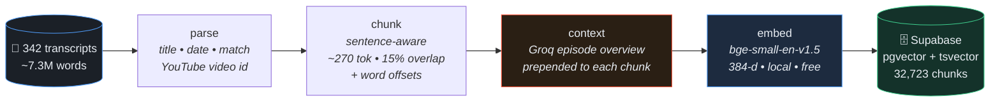
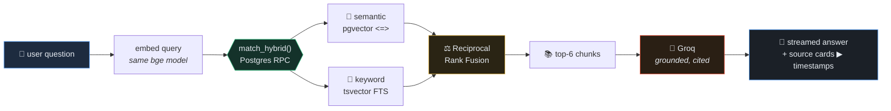
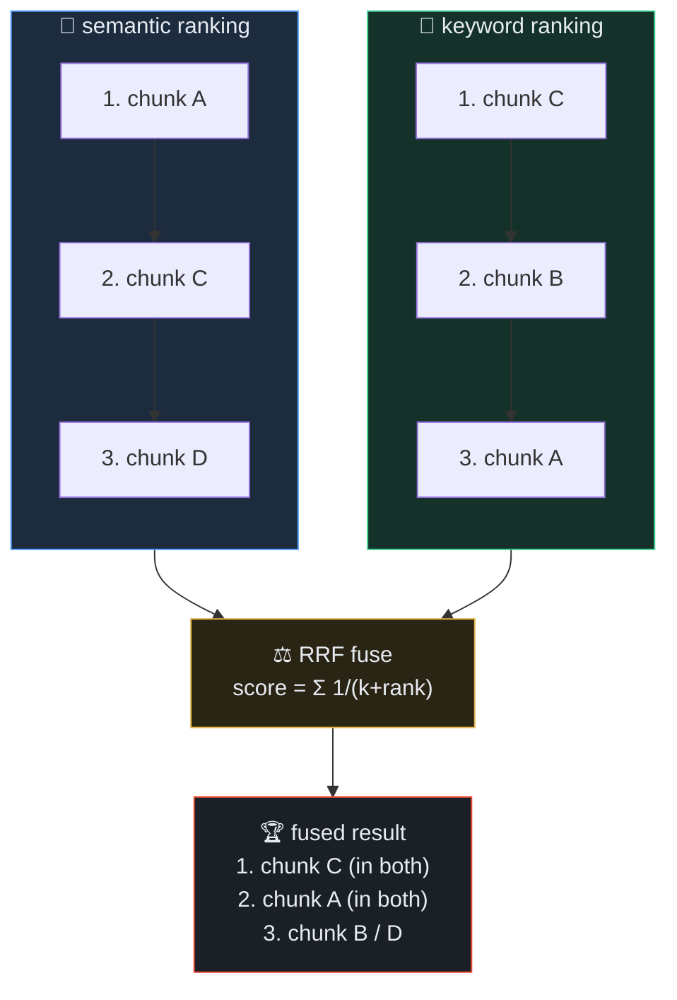

<div align="center">

# 🧠 Huberman Lab RAG

**Ask anything across 342 Huberman Lab episodes (~7.3M words) — get answers grounded in transcript excerpts with cited, timestamped sources that deep-link to the exact moment in the video.**

[](https://nextjs.org/)
[](https://www.typescriptlang.org/)
[](https://supabase.com/)
[](https://groq.com/)
[](#-stack--cost)

</div>

---

A production-shaped Retrieval-Augmented Generation system built end-to-end: an ingestion pipeline, a **hybrid (semantic + keyword) retriever fused with Reciprocal Rank Fusion**, **Contextual Retrieval**, grounded generation with citations, and an **LLM-judged evaluation harness**. Runs entirely on free tiers.

## ✨ Highlights

- 🔀 **Hybrid retrieval** — pgvector semantic search **+** Postgres full-text search, fused with **Reciprocal Rank Fusion** in a single SQL function.
- 🧩 **Contextual Retrieval** — every chunk is prefixed with an LLM-generated episode overview before embedding (Anthropic's technique), so isolated chunks keep their meaning.
- ⏱️ **Timestamped citations** — answers cite `[n]` sources that deep-link to `youtube.com/watch?v=…&t=NNNs` (timestamps estimated from word position).
- 📊 **Evaluation harness** — semantic vs keyword vs hybrid ablation on **P@1 / hit-rate / MRR / nDCG**, with **LLM-judged relevance** + answer faithfulness.
- 💸 **$0 stack** — local embeddings, free Supabase, free Groq, free Vercel.
- 🧠 **One embedding model, two call sites** — ingest and query share `lib/embeddings.ts`, guaranteeing both vectors live in the same space.

## 🏗️ Ingestion pipeline



## 🔎 Query-time RAG flow



## ⚖️ Why hybrid + RRF

Semantic search captures *meaning* but misses exact terms (drug names, study authors, jargon). Keyword search nails exact terms but misses paraphrases. **RRF fuses both ranked lists** — a doc's score = Σ `1 / (k + rank)` across the lists it appears in — without having to normalize incomparable score scales.



> Real example from this corpus — *"what is the physiological sigh?"* surfaces the dedicated episode clip as a **keyword-only** hit (`sem#null kw#2`) that pure vector search ranked far lower. Hybrid recovers it.

## 🧭 Design decisions

**How transcripts are chunked.** Transcripts are split into **~270-token, sentence-aware chunks with ~15% overlap**. The size is deliberate: the embedding model truncates at 512 tokens and each chunk is later prefixed with a context header, so the body has to leave headroom. Overlap means a fact split across a boundary stays retrievable from both sides. Some episodes are auto-caption style (lowercase, almost no punctuation), so any "sentence" longer than the target is hard-wrapped on word boundaries — otherwise a single 20k-word run would become one giant chunk.

**Embedding model choice.** `bge-small-en-v1.5` (384-dim). It punches well above its size on retrieval benchmarks, runs **locally for free** (no API keys, no rate limits, no per-token cost), and its small vectors keep the database light. bge is asymmetric, so queries get an instruction prefix and passages don't. Critically, the **same model is used at ingest and query time** — if those ever diverged, query and passage vectors would land in different spaces and retrieval would silently degrade.

**Why this vector DB.** Supabase (Postgres + pgvector) was chosen because it provides **both** halves of hybrid search in one place: vector similarity (pgvector) *and* full-text keyword search (`tsvector`). That lets the fusion happen **server-side in a single SQL function** instead of stitching two systems together in app code. It's free, hosted (the app queries it directly), and an **HNSW** index gives high recall without parameter tuning.

**How retrieval quality is handled.** Three layers: (1) **hybrid retrieval** — semantic catches meaning, keyword catches exact terms (drug names, study authors, jargon), and **Reciprocal Rank Fusion** merges them without normalizing incompatible score scales; (2) **Contextual Retrieval** — each chunk is embedded with a short LLM episode overview prepended, so a chunk like *"he recommends 13 minutes"* still carries what it's 13 minutes *of*; (3) **measurement** — an ablation harness with **LLM-judged relevance** confirms hybrid actually beats either method alone, rather than assuming it does.

**How hallucination is handled.** Generation is **strictly grounded**: the system prompt instructs the model to answer *only* from the retrieved excerpts, to cite every claim with `[n]`, and to say so plainly when the excerpts don't contain the answer. A **guardrail** short-circuits to an honest "not in the indexed episodes" response when retrieval comes back empty. And faithfulness isn't assumed — an **LLM judge scores how well each answer is supported by its retrieved context**, surfacing ungrounded claims as a metric.

## 📊 Evaluation

18 questions (incl. paraphrased queries with no shared vocabulary) over all 32,723 chunks. Relevance is decided by an **LLM judge over the pooled candidates of all three methods** — so the comparison isn't biased toward lexical matching.

<!-- EVAL_RESULTS -->
| method | P@1 | hit-rate@6 | MRR | nDCG@6 |
|---|---|---|---|---|
| semantic only | 66.7% | 100.0% | 0.803 | 0.712 |
| keyword only | 72.2% | 94.4% | 0.824 | 0.632 |
| **hybrid (RRF)** | **77.8%** | **100.0%** | **0.875** | **0.732** |

**Generation faithfulness (LLM-judged): 0.82 / 1.0**

**Hybrid wins on every ranking metric** — highest precision@1, MRR, and nDCG, while matching the best hit-rate. Keyword-only has both the lowest hit-rate and the lowest nDCG, and semantic-only trails on early-rank precision: exactly the complementary weaknesses RRF is designed to cover.
<!-- /EVAL_RESULTS -->

Run it yourself:

```bash
pnpm eval        # ablation + faithfulness  → data/eval-results.json
pnpm search "how should I use cold exposure?"   # offline hybrid search
```

## 🧰 Stack & cost

| Layer | Choice | Cost |
|---|---|---|
| Embeddings | `bge-small-en-v1.5` (384-d) via `@huggingface/transformers`, **local** | $0 |
| Vector + keyword store | Supabase — pgvector (HNSW) + Postgres FTS | $0 |
| LLM (context + answers) | Groq free tier (Llama 3.x) | $0 |
| App / hosting | Next.js on Vercel Hobby | $0 |

## 🚀 Setup

```bash
pnpm install
cp .env.example .env          # add GROQ + Supabase keys
```

**Ingest** (one-time, local):

```bash
pnpm ingest:parse     # → data/documents.json
pnpm ingest:chunk     # → data/chunks.json   (~32.7k chunks)
pnpm ingest:context   # → data/chunks_ctx.json   (needs GROQ_API_KEY)
pnpm ingest:embed     # → data/embedded.jsonl    (~30 min, local)
# paste supabase/schema.sql into the Supabase SQL editor, then:
pnpm ingest:upload    # → Supabase
```

**Run:**

```bash
pnpm dev              # http://localhost:3000
```

## 📁 Project layout

```
lib/
  embeddings.ts   shared bge-small embedder (ingest + query)
  retrieval.ts    in-memory hybrid/RRF (offline search + eval)
  chunk.ts        sentence-aware chunker
  supabase.ts     anon (read) + service-role (write) clients
scripts/          parse → chunk → context → embed → upload, + search + eval
supabase/
  schema.sql      table, HNSW + GIN indexes, match_hybrid() RRF function
app/
  api/chat/route.ts   embed → hybrid retrieve → stream grounded answer
  page.tsx            chat UI with timestamped source cards
```

## 📝 Notes & tradeoffs

- **Timestamps are estimated** (word position ÷ ~150 wpm) — transcripts are prose with no time codes. Exact timestamps would require re-aligning YouTube captions.
- **Contextual Retrieval is episode-scoped** (one overview per episode, reused across its chunks) to fit free-tier LLM limits.
- Transcripts are **not** included in this repo (copyright); the pipeline expects them in `huberman_transcripts/`.
