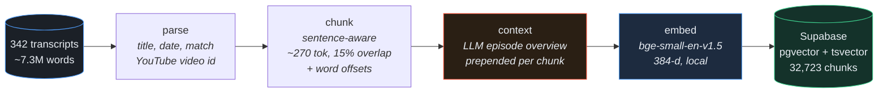
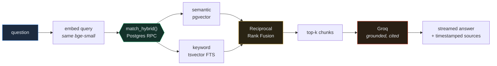

<div align="center">

# Huberman GPT

**Ask anything across ~800 hours of the Huberman Lab podcast and get answers grounded in the transcripts, with cited sources that deep-link to the moment in the video.**

[](https://nextjs.org/)
[](https://www.typescriptlang.org/)
[](https://supabase.com/)
[](https://groq.com/)

</div>

A retrieval-augmented generation system over every Huberman Lab episode (342 transcripts, ~7.3M words). Hybrid retrieval, contextual chunking, grounded generation with citations, and an LLM-judged evaluation harness — running end to end on free tiers.

## Ingestion pipeline



## Query flow



## Design decisions

**Chunking.** ~270-token, sentence-aware chunks with 15% overlap. The size is bounded by the embedder's 512-token limit minus the context header; overlap keeps facts that straddle a boundary retrievable. Caption-style transcripts (no punctuation) are hard-wrapped on word boundaries so one runaway "sentence" can't swallow an episode.

**Embedding model.** `bge-small-en-v1.5` — strong retrieval quality at 384 dimensions, runs locally for free. The same model embeds the corpus and the query; if those diverged, the vectors would live in different spaces and retrieval would quietly degrade.

**Vector store.** Supabase gives vector search (pgvector) and full-text search (`tsvector`) in one database, so hybrid fusion runs server-side in a single SQL function rather than being stitched together in app code.

**Retrieval quality.** Hybrid retrieval (semantic for meaning, keyword for exact terms) fused with RRF, plus contextual retrieval — each chunk carries a one-line episode overview so it keeps its context. A cross-encoder reranker was added and measured, but it didn't beat plain hybrid on this corpus, so it stays in the offline harness rather than the live path (see the iteration log).

**Hallucination.** The model answers only from retrieved excerpts, cites every claim, and says so when the excerpts don't cover the question. A guardrail refuses when nothing relevant is retrieved, and an LLM judge scores answer-vs-context faithfulness in the eval.

## Evaluation

Questions are scored by an LLM judge over the pooled candidates of every method, so the comparison isn't biased toward lexical matching. Metrics: precision@1, hit-rate, MRR, nDCG.

<!-- EVAL_RESULTS -->
100 questions (easy/medium/hard), k=6:

| method | P@1 | hit@6 | MRR | nDCG@6 |
|---|---|---|---|---|
| semantic | **81.0%** | 98.0% | **0.887** | 0.733 |
| keyword | 69.0% | 90.0% | 0.771 | 0.590 |
| hybrid (RRF) | 77.0% | **99.0%** | 0.871 | **0.741** |
| hybrid + reranker | 67.0% | 99.0% | 0.819 | 0.725 |

Faithfulness (LLM-judged): 0.80.

Semantic and hybrid are both strong (hybrid takes hit-rate and nDCG; semantic edges top-rank precision); keyword alone clearly lags. The cross-encoder reranker did **not** help on this corpus — it lowered P@1 — so the live app uses hybrid retrieval and the reranker stays in this offline harness. See the iteration log below.
<!-- /EVAL_RESULTS -->

```bash
pnpm eval        # ablation + faithfulness
pnpm search "how should I use cold exposure?"
```

## Stack and cost

| Layer | Choice | Cost |
|---|---|---|
| Embeddings | bge-small-en-v1.5, local (ingest) / HF Inference API (query) | $0 |
| Vector + keyword store | Supabase — pgvector (HNSW) + Postgres FTS | $0 |
| LLM | Groq free tier (Llama 3.x) | $0 |
| Rate limit + cache | Upstash Redis + Vector | $0 |
| Hosting | Next.js on Vercel | $0 |

## Setup

```bash
pnpm install
cp .env.example .env          # GROQ + Supabase keys (HF + Upstash optional)
```

Ingest (one-time, local):

```bash
pnpm ingest:parse
pnpm ingest:chunk
pnpm ingest:context           # needs GROQ_API_KEY
pnpm ingest:embed             # ~30 min, local
# paste supabase/schema.sql into the Supabase SQL editor, then:
pnpm ingest:upload
```

Run: `pnpm dev`

## Notes and tradeoffs

- Timestamps are estimated from word position (~150 wpm); transcripts have no time codes. Exact timestamps would require aligning YouTube captions.
- Contextual retrieval is episode-scoped (one overview per episode) to fit free-tier LLM limits.
- Query embedding on the deployed app goes through the HF Inference API (same bge-small model), because bundling the ONNX runtime would exceed Vercel's 250 MB function limit.
- The cross-encoder reranker is offline-only — it didn't improve retrieval in the eval (see iteration log).
- Transcripts are not included in this repo (copyright); the pipeline expects them in `huberman_transcripts/`.

## Iteration log

**v1 — first pass.** Hybrid (semantic + keyword, RRF) + contextual retrieval, sanity-checked on 18 LLM-judged questions. That run made hybrid look like a clear winner over semantic and keyword.

**v2 — bigger eval + a reranker.** Two changes: scaled the eval to 100 questions across easy/medium/hard (the 18-question set was too small to trust), and added a `bge-reranker-base` cross-encoder as a second stage.

The larger eval changed the story. At 100 questions, semantic and hybrid are effectively tied — hybrid wins hit-rate and nDCG, semantic edges top-rank precision — and keyword alone clearly lags. The headline though: the **reranker didn't help** — it lowered P@1 (67% vs hybrid's 77%) while adding latency. So the live app stays on hybrid retrieval and the reranker is kept in the offline harness. Two takeaways: small evals are noisy enough to mislead, and a technique that "should" help is worth measuring before shipping.
